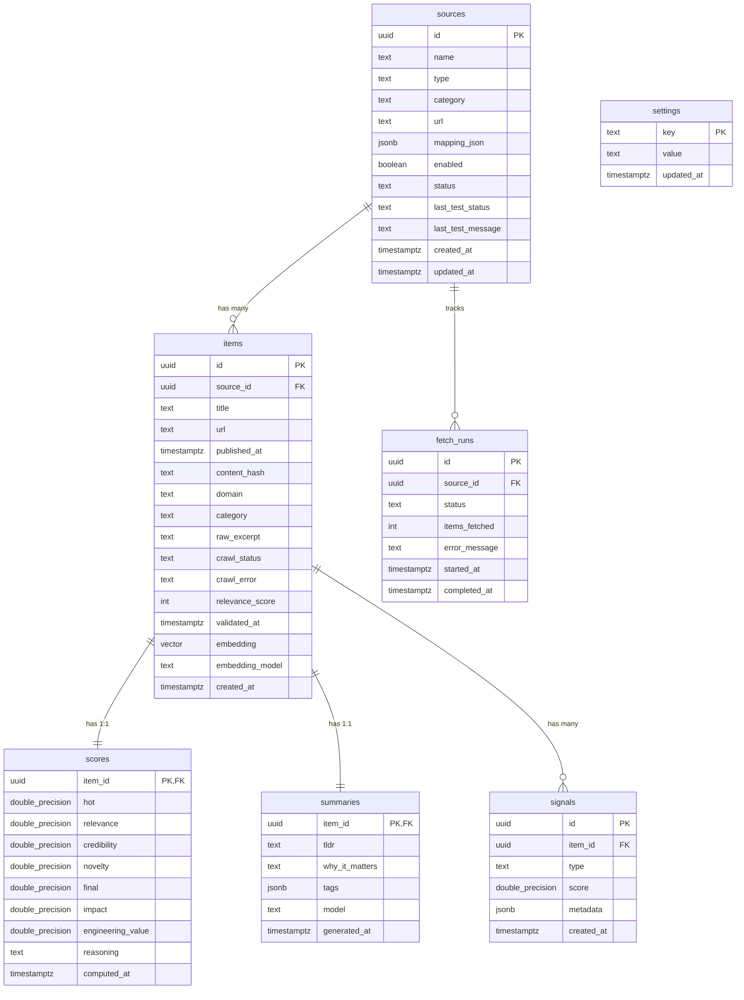

# 🗄️ Neon Database Schema & ERD Documentation

This document provides a comprehensive database schema specification for **Evolipia Radar** hosted on **Neon.tech (Serverless PostgreSQL)**, detailing entity relationships (ERD), performance indexes, vector search support (`pgvector`), and migration history.

---

## 📐 Entity Relationship Diagram (ERD)

---

## 📋 Table Specifications

### 1. Table `sources`
Stores source configurations and metadata for news ingestion agents (RSS feeds, APIs, scrapers).
- `id` (UUID, Primary Key, Default: `gen_random_uuid()`)
- `name` (TEXT, NOT NULL): Name of the source (e.g., "TechCrunch AI", "ArXiv AI").
- `type` (TEXT, NOT NULL): Ingestion agent type (`rss`, `api`, `scrape`, `trending`).
- `category` (TEXT, NULLABLE): Default category (`llm`, `agents`, `vision`, `infra`).
- `url` (TEXT, NOT NULL): Target URL for RSS feeds or APIs.
- `mapping_json` (JSONB, NULLABLE): Custom field mapping for parser.
- `enabled` (BOOLEAN, DEFAULT: `true`): Active/inactive state flag.
- `status` (TEXT, DEFAULT: `'active'`): Health status (`active`, `degraded`, `unhealthy`).
- `created_at` / `updated_at` (TIMESTAMPTZ, DEFAULT: `NOW()`).

### 2. Table `items`
Main repository table for validated and processed AI news articles.
- `id` (UUID, Primary Key, Default: `gen_random_uuid()`)
- `source_id` (UUID, Foreign Key to `sources(id)` ON DELETE SET NULL).
- `title` (TEXT, NOT NULL): Article title.
- `url` (TEXT, NOT NULL, UNIQUE): Original source URL.
- `published_at` (TIMESTAMPTZ, NOT NULL): Publication timestamp.
- `content_hash` (TEXT, UNIQUE): SHA-256 hash of Title + URL for deduplication.
- `domain` (TEXT, NULLABLE): Origin domain (e.g., `arxiv.org`, `techcrunch.com`).
- `category` (TEXT, NULLABLE): Category classification (`llm`, `agents`, `vision`, `infra`).
- `raw_excerpt` (TEXT, NULLABLE): Raw text snippet or content excerpt.
- `crawl_status` (TEXT, DEFAULT: `'verified'`): Crawl status (`verified`, `pending`, `done`, `failed`).
- `crawl_error` (TEXT, NULLABLE): Error message if ingestion failed.
- `relevance_score` (INT, DEFAULT: `0`): Initial keyword relevance score (0-100).
- `validated_at` (TIMESTAMPTZ, NULLABLE): Validation timestamp.
- `embedding` (VECTOR, NULLABLE): `pgvector` column (1536-dimensional vector embedding for semantic search).
- `embedding_model` (TEXT, NULLABLE): Model used for generating embeddings (e.g., `text-embedding-3-small`).
- `created_at` (TIMESTAMPTZ, DEFAULT: `NOW()`).

### 3. Table `scores`
Stores multi-factor score evaluations for each item (1:1 relationship with `items`).
- `item_id` (UUID, PK, FK to `items(id)` ON DELETE CASCADE).
- `hot` (DOUBLE PRECISION, DEFAULT: 0.0): Popularity / trending score.
- `relevance` (DOUBLE PRECISION, DEFAULT: 0.0): Topic relevance score.
- `credibility` (DOUBLE PRECISION, DEFAULT: 0.0): Source credibility score.
- `novelty` (DOUBLE PRECISION, DEFAULT: 0.0): Breakthrough recency score.
- `impact` (DOUBLE PRECISION, DEFAULT: 0.0): Industry impact weight.
- `engineering_value` (DOUBLE PRECISION, DEFAULT: 0.0): Technical content density score.
- `final` (DOUBLE PRECISION, DEFAULT: 0.0): Aggregate final score.
- `reasoning` (TEXT, NULLABLE): Scoring rationale from algorithm or LLM.
- `computed_at` (TIMESTAMPTZ, DEFAULT: `NOW()`).

### 4. Table `summaries`
Stores AI-generated summaries for each item (1:1 relationship with `items`).
- `item_id` (UUID, PK, FK to `items(id)` ON DELETE CASCADE).
- `tldr` (TEXT, NOT NULL): 1-2 sentence executive summary.
- `why_it_matters` (TEXT, NULLABLE): Explanation of strategic or technical importance.
- `tags` (JSONB, DEFAULT: `'[]'`): Keyword tag array (e.g., `["llm", "agents"]`).
- `model` (TEXT, NULLABLE): LLM model name used to generate summary.
- `generated_at` (TIMESTAMPTZ, DEFAULT: `NOW()`).

---

## 🔍 Database Migration History (`migrations/`)

The application utilizes `golang-migrate` for sequential SQL migrations:

1. **`000001_init_schema.up.sql`**: Enables `pgcrypto` extension and creates core tables: `sources`, `items`, `scores`, `summaries`, `signals`, and `settings`.
2. **`000003_add_clustering.up.sql`**: Adds table clustering support and topic groupings.
3. **`000004_add_metrics.up.sql`**: Adds telemetry table `fetch_runs` for tracking crawler executions.
4. **`000005_add_settings_and_metrics.up.sql`**: Enhances configuration settings storage.
5. **`000006_add_pgvector.up.sql`**: Enables `vector` extension (`pgvector`) and adds `embedding` and `embedding_model` columns to `items`.
6. **`000007_add_llm_scores.up.sql`**: Adds `impact` and `engineering_value` columns to `scores`.
7. **`000008_add_crawl_fields.up.sql`**: Adds `crawl_status`, `crawl_error`, `relevance_score`, and `validated_at` columns to `items`.

---

## ⚡ Indexing Strategy

- `idx_items_published_at`: Index on `items(published_at DESC)` for fast chronological pagination.
- `idx_items_source_id`: Foreign key index on `items(source_id)` for optimized joins.
- `idx_items_content_hash`: UNIQUE index on `items(content_hash)` for instant deduplication checks.
- `idx_items_embedding`: HNSW / IVFFlat Index on `items(embedding vector_cosine_ops)` for ultra-fast semantic similarity search via pgvector.
