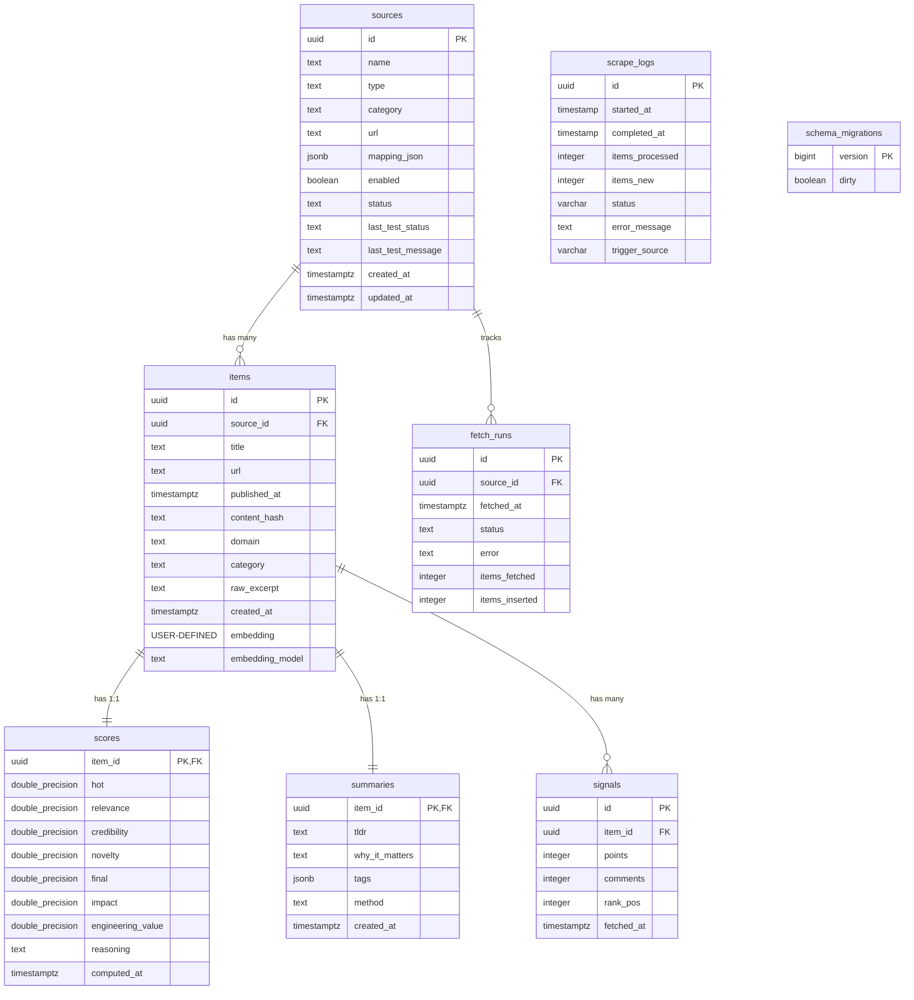

# Neon Database Schema & ERD Documentation

Comprehensive database schema reference and Entity Relationship Diagram (ERD) for **Evolipia Radar** hosted on **Neon.tech (PostgreSQL)**.

---

## 📐 Entity Relationship Diagram (ERD)

---

## 🗃️ Table Specifications

### 1. `items`
Primary table storing intelligence articles and candidate signals scraped from various sources.

| Column | Data Type | Nullable | Default | Key / FK | Description |
|---|---|---|---|---|---|
| `id` | `uuid` | NO | `gen_random_uuid()` | **PK** | Unique item ID |
| `source_id` | `uuid` | NO | - | **FK** (`sources.id`) | Reference to parent source |
| `title` | `text` | NO | - | - | Headline title |
| `url` | `text` | NO | - | - | Original article URL |
| `published_at` | `timestamptz` | NO | - | - | Article publication timestamp |
| `content_hash` | `text` | NO | - | - | Deduplication hash |
| `domain` | `text` | NO | - | - | Website domain (e.g. `arxiv.org`, `github.com`) |
| `category` | `text` | NO | - | - | AI Category (e.g. `llm`, `agents`, `vision`) |
| `raw_excerpt` | `text` | YES | - | - | Extracted text snippet |
| `created_at` | `timestamptz` | NO | `now()` | - | Record insertion timestamp |
| `embedding` | `vector` | YES | - | - | pgvector embedding vector |
| `embedding_model` | `text` | YES | - | - | Vector embedding model identifier |

---

### 2. `scores`
Scores and relevance metrics calculated per item.

| Column | Data Type | Nullable | Default | Key / FK | Description |
|---|---|---|---|---|---|
| `item_id` | `uuid` | NO | - | **PK**, **FK** (`items.id`) | 1-to-1 link to items table |
| `hot` | `double precision` | NO | - | - | Recency & velocity score |
| `relevance` | `double precision` | NO | - | - | AI domain relevance score (0.0-1.0) |
| `credibility` | `double precision` | NO | - | - | Source credibility index |
| `novelty` | `double precision` | NO | - | - | Uniqueness score |
| `final` | `double precision` | NO | - | - | Weighted composite final score |
| `impact` | `double precision` | NO | `0.0` | - | Ecosystem impact score |
| `engineering_value` | `double precision` | NO | `0.0` | - | Practical developer value score |
| `reasoning` | `text` | NO | `''` | - | LLM scoring explanation |
| `computed_at` | `timestamptz` | NO | `now()` | - | Score calculation timestamp |

---

### 3. `summaries`
AI-generated executive briefings, key takeaways, and tags for items.

| Column | Data Type | Nullable | Default | Key / FK | Description |
|---|---|---|---|---|---|
| `item_id` | `uuid` | NO | - | **PK**, **FK** (`items.id`) | 1-to-1 link to items table |
| `tldr` | `text` | NO | - | - | Single-sentence TL;DR summary |
| `why_it_matters` | `text` | NO | - | - | Strategic impact summary |
| `tags` | `jsonb` | NO | - | - | Topic tags array (e.g. `["llm", "open_source"]`) |
| `method` | `text` | NO | - | - | Summarization method (`llm` or `extractive`) |
| `created_at` | `timestamptz` | NO | `now()` | - | Summary creation timestamp |

---

### 4. `sources`
Configuration registry for crawled websites, RSS feeds, and APIs.

| Column | Data Type | Nullable | Default | Key / FK | Description |
|---|---|---|---|---|---|
| `id` | `uuid` | NO | `gen_random_uuid()` | **PK** | Source unique ID |
| `name` | `text` | NO | - | - | Display name |
| `type` | `text` | NO | - | - | Source type (`rss`, `api`, `scrape`) |
| `category` | `text` | NO | - | - | Target category |
| `url` | `text` | NO | - | - | Base feed/endpoint URL |
| `mapping_json` | `jsonb` | YES | - | - | JSON parsing rule map |
| `enabled` | `boolean` | NO | `false` | - | Active toggle flag |
| `status` | `text` | NO | `'pending'` | - | Current health status |
| `last_test_status` | `text` | YES | - | - | Last validation result |
| `last_test_message` | `text` | YES | - | - | Health test output message |
| `created_at` | `timestamptz` | NO | `now()` | - | Creation timestamp |
| `updated_at` | `timestamptz` | NO | `now()` | - | Modification timestamp |

---

### 5. `signals`
Time-series social velocity signals (points, comments, rank position).

| Column | Data Type | Nullable | Default | Key / FK | Description |
|---|---|---|---|---|---|
| `id` | `uuid` | NO | `gen_random_uuid()` | **PK** | Signal ID |
| `item_id` | `uuid` | NO | - | **FK** (`items.id`) | Target item ID |
| `points` | `integer` | YES | - | - | Upvotes / points count |
| `comments` | `integer` | YES | - | - | Discussion comment count |
| `rank_pos` | `integer` | YES | - | - | Leaderboard rank position |
| `fetched_at` | `timestamptz` | NO | `now()` | - | Signal snapshot timestamp |

---

### 6. `fetch_runs`
Audit history of source scraper runs.

| Column | Data Type | Nullable | Default | Key / FK | Description |
|---|---|---|---|---|---|
| `id` | `uuid` | NO | `gen_random_uuid()` | **PK** | Fetch run ID |
| `source_id` | `uuid` | NO | - | **FK** (`sources.id`) | Target source ID |
| `fetched_at` | `timestamptz` | NO | `now()` | - | Run timestamp |
| `status` | `text` | NO | - | - | Status (`success`, `failed`) |
| `error` | `text` | YES | - | - | Error message if failed |
| `items_fetched` | `integer` | NO | `0` | - | Count of fetched items |
| `items_inserted` | `integer` | NO | `0` | - | Count of newly inserted items |

---

### 7. `scrape_logs`
Global scraper execution logs.

| Column | Data Type | Nullable | Default | Key / FK | Description |
|---|---|---|---|---|---|
| `id` | `uuid` | NO | `gen_random_uuid()` | **PK** | Log ID |
| `started_at` | `timestamp` | NO | `now()` | - | Start time |
| `completed_at` | `timestamp` | YES | - | - | Finish time |
| `items_processed` | `integer` | YES | `0` | - | Total processed items |
| `items_new` | `integer` | YES | `0` | - | Total new items saved |
| `status` | `varchar(20)`| YES | `'running'` | - | Status state |
| `error_message` | `text` | YES | - | - | Error log |
| `trigger_source` | `varchar(50)`| YES | `'github_actions'`| - | Execution trigger |

---

### 8. `schema_migrations`
Track applied database migration scripts (`golang-migrate`).

| Column | Data Type | Nullable | Default | Key / FK | Description |
|---|---|---|---|---|---|
| `version` | `bigint` | NO | - | **PK** | Migration version number |
| `dirty` | `boolean` | NO | - | - | Migration dirty state flag |
